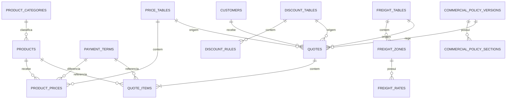

# Modelagem proposta para Supabase e PostgreSQL

## Status

Implementado incrementalmente até o BLOCO 11 no projeto Supabase `qualinutri-projeto` (`yvpfffhbqyzcxxxqifva`). Schema comercial, seed legado, clientes, orçamentos, autenticação por perfis e políticas RLS foram aplicados por migrations versionadas em 30/09/2026.

## Princípios

- O snapshot versionado `src/data/commercial-snapshot.json` preserva a fonte do primeiro seed.
- Preços, descontos, fretes e política são versionados e nunca sobrescritos silenciosamente.
- Orçamentos guardam snapshots completos dos valores utilizados.
- Valores monetários usam `numeric`, nunca `real`, `double precision` ou `money`.
- Cálculos continuam no domínio TypeScript; o banco persiste entradas, referências e resultados.
- Toda tabela exposta pela API terá RLS habilitada desde a migration inicial.
- A `service_role` ou secret key nunca será usada no frontend.
- Nomes e valores do legado não serão normalizados durante o primeiro seed.

## Visão geral



## Convenções comuns

- Chaves primárias: `uuid`, geradas com `gen_random_uuid()`.
- Instantes: `timestamptz` com `default now()`.
- Datas de vigência comercial: `date`.
- Nomes e descrições: `text`.
- Ordem visual: `integer` com `check (display_order >= 0)`.
- Valores de entrada em moeda: `numeric(12,2)`.
- Valores calculados intermediários: `numeric(16,6)`.
- Percentuais: `numeric(7,4)`.
- Pesos: `numeric(12,3)` em quilogramas.
- Quantidades de sacas: `integer` no modelo atual.
- Estados extensíveis usam `text` com `check`, evitando tipos enum difíceis de evoluir.
- Registros comerciais publicados não serão apagados; serão expirados ou arquivados.

## Catálogo

### `product_categories`

| Coluna | Tipo | Regra |
|---|---|---|
| `id` | `uuid` | PK |
| `code` | `text` | único e estável |
| `name` | `text` | nome exibido no HTML |
| `display_order` | `integer` | ordem da tabela |
| `active` | `boolean` | padrão `true` |
| `created_at` | `timestamptz` | padrão `now()` |
| `updated_at` | `timestamptz` | padrão `now()` |

Categorias iniciais são preservadas como aparecem no HTML: Rações, Energéticos, Aves, Suínos, Mineral, Mineral Aditivado, Mineral Adensado, Proteinado (Nutri pasto) e Núcleos e Concentrados.

### `products`

| Coluna | Tipo | Regra |
|---|---|---|
| `id` | `uuid` | PK |
| `category_id` | `uuid` | FK para `product_categories` |
| `code` | `text` | identificador estável e único |
| `name` | `text` | nome original do HTML |
| `package_weight_kg` | `numeric(12,3)` | maior que zero |
| `display_order` | `integer` | preserva a ordem atual |
| `active` | `boolean` | padrão `true` |
| `created_at` | `timestamptz` | padrão `now()` |
| `updated_at` | `timestamptz` | padrão `now()` |

O nome não será usado como chave. Isso permite corrigir uma apresentação futura sem quebrar relações históricas.

## Condições e preços

### `payment_terms`

| Coluna | Tipo | Regra |
|---|---|---|
| `id` | `uuid` | PK |
| `code` | `text` | único |
| `label` | `text` | texto curto, como `30 dd` |
| `description` | `text` | condição por extenso |
| `average_days` | `integer` | zero ou positivo |
| `display_order` | `integer` | posição da coluna no HTML |
| `active` | `boolean` | padrão `true` |
| `created_at` | `timestamptz` | padrão `now()` |

Serão cadastradas as seis condições que possuem preço próprio: à vista, 30, 45, 60, 75 e 90 dias. A antecipação de 1,5% será uma regra de desconto, pois no sistema atual ela modifica o preço à vista e também pode ser marcada com outros prazos.

### `price_tables`

| Coluna | Tipo | Regra |
|---|---|---|
| `id` | `uuid` | PK |
| `code` | `text` | único |
| `name` | `text` | identificação comercial |
| `version` | `text` | versão legível |
| `effective_from` | `date` | obrigatório |
| `effective_until` | `date` | opcional e posterior ao início |
| `status` | `text` | `draft`, `active`, `expired` ou `archived` |
| `notes` | `text` | opcional |
| `activated_at` | `timestamptz` | opcional |
| `created_at` | `timestamptz` | padrão `now()` |
| `updated_at` | `timestamptz` | padrão `now()` |

Índice parcial recomendado para impedir mais de uma tabela global ativa:

```sql
create unique index one_active_price_table
on price_tables ((status))
where status = 'active';
```

### `product_prices`

| Coluna | Tipo | Regra |
|---|---|---|
| `id` | `uuid` | PK |
| `price_table_id` | `uuid` | FK para `price_tables` |
| `product_id` | `uuid` | FK para `products` |
| `payment_term_id` | `uuid` | FK para `payment_terms` |
| `unit_price` | `numeric(12,2)` | zero ou positivo |
| `created_at` | `timestamptz` | padrão `now()` |

Restrição única:

```text
(price_table_id, product_id, payment_term_id)
```

Uma nova tabela cria novos registros. Preços publicados anteriormente não serão atualizados.

## Descontos

### `discount_tables`

Versiona o conjunto de descontos e evita que uma mudança futura altere a interpretação de um orçamento anterior.

| Coluna | Tipo |
|---|---|
| `id` | `uuid` PK |
| `code` | `text` único |
| `name` | `text` |
| `version` | `text` |
| `effective_from` | `date` |
| `effective_until` | `date` opcional |
| `status` | `text` com os mesmos estados das tabelas de preço |
| `created_at` | `timestamptz` |
| `updated_at` | `timestamptz` |

### `discount_rules`

| Coluna | Tipo | Regra |
|---|---|---|
| `id` | `uuid` | PK |
| `discount_table_id` | `uuid` | FK para `discount_tables` |
| `code` | `text` | único dentro da versão |
| `name` | `text` | texto original |
| `percentage` | `numeric(7,4)` | pode ser nulo para personalizado |
| `allows_custom_percentage` | `boolean` | identifica “Outro / personalizado” |
| `rule_kind` | `text` | `line`, `anticipated` ou `custom` |
| `display_order` | `integer` | ordem da interface |
| `active` | `boolean` | padrão `true` |

Não haverá relação automática entre produto e desconto no seed inicial. O HTML permite que o usuário escolha qualquer linha; criar essa associação agora alteraria a regra atual. Uma futura `product_discount_rules` dependerá de decisão comercial.

## Frete e chapa

### `freight_tables`

| Coluna | Tipo | Regra |
|---|---|---|
| `id` | `uuid` | PK |
| `code` | `text` | único |
| `name` | `text` | Juara ou Regional |
| `scope_type` | `text` | `distance` ou `location` |
| `version` | `text` | versão legível |
| `effective_from` | `date` | obrigatório |
| `effective_until` | `date` | opcional |
| `status` | `text` | estado da versão |
| `created_at` | `timestamptz` | padrão `now()` |
| `updated_at` | `timestamptz` | padrão `now()` |

Pode existir uma tabela ativa por `code`, permitindo Juara e Regional simultaneamente.

### `freight_zones`

| Coluna | Tipo | Uso |
|---|---|---|
| `id` | `uuid` | PK |
| `freight_table_id` | `uuid` | FK |
| `code` | `text` | identificador estável |
| `label` | `text` | faixa ou cidade exibida |
| `minimum_distance_km` | `numeric(10,2)` | opcional |
| `maximum_distance_km` | `numeric(10,2)` | opcional |
| `minimum_weight_kg` | `numeric(12,3)` | 9.000 ou 10.000 quando descrito |
| `display_order` | `integer` | ordem atual |
| `active` | `boolean` | padrão `true` |

`minimum_weight_kg` será armazenado, mas inicialmente continuará apenas informativo, como no HTML.

### `freight_rates`

| Coluna | Tipo | Regra |
|---|---|---|
| `id` | `uuid` | PK |
| `freight_zone_id` | `uuid` | FK |
| `load_type` | `text` | `fractional` ou `closed` |
| `rate_basis` | `text` | `per_bag` ou `per_ton` |
| `bag_weight_kg` | `numeric(12,3)` | obrigatório somente para `per_bag` |
| `amount` | `numeric(12,2)` | zero ou positivo |
| `created_at` | `timestamptz` | padrão `now()` |

Representação:

- Juara fracionado: três tarifas `per_bag` por faixa, para 25, 30 e 40 kg.
- Juara fechado: uma tarifa `per_ton` por faixa.
- Regional: tarifas `per_ton` por cidade e tipo de carga.
- Ausência de tarifa fracionada é ausência de linha, não valor zero.

O frontend continuará convertendo ausência de tarifa regional em zero mais aviso enquanto essa regra não for alterada.

### `handling_rate_tables`

| Coluna | Tipo |
|---|---|
| `id` | `uuid` PK |
| `code` | `text` único |
| `name` | `text` |
| `amount_per_ton` | `numeric(12,2)` |
| `effective_from` | `date` |
| `effective_until` | `date` opcional |
| `status` | `text` |
| `created_at` | `timestamptz` |

O valor inicial será R$ 40,00 por tonelada. Separá-lo do frete permite versioná-lo sem duplicar todas as faixas.

## Política comercial

### `commercial_policy_versions`

| Coluna | Tipo |
|---|---|
| `id` | `uuid` PK |
| `version` | `text` único |
| `title` | `text` |
| `effective_from` | `date` opcional |
| `effective_until` | `date` opcional |
| `status` | `text`: `draft`, `active`, `expired`, `archived` |
| `approved_at` | `timestamptz` opcional |
| `created_at` | `timestamptz` |
| `updated_at` | `timestamptz` |

### `commercial_policy_sections`

| Coluna | Tipo |
|---|---|
| `id` | `uuid` PK |
| `policy_version_id` | `uuid` FK |
| `section_number` | `text` |
| `title` | `text` |
| `content` | `text` |
| `is_pending` | `boolean` |
| `display_order` | `integer` |

Cada versão possui suas próprias seções. Publicar 1.3 não altera 1.2.

## Clientes

### `customers`

Implementada no BLOCO 10. No BLOCO 11, o acesso foi liberado por RLS apenas para administradores e usuários comerciais ativos; acesso anônimo permanece bloqueado.

| Coluna | Tipo |
|---|---|
| `id` | `uuid` PK |
| `legal_name` | `text` |
| `trade_name` | `text` opcional |
| `document` | `text` opcional |
| `phone` | `text` opcional |
| `email` | `text` opcional |
| `address` | `jsonb` opcional |
| `notes` | `text` opcional |
| `active` | `boolean` |
| `created_at` | `timestamptz` |
| `updated_at` | `timestamptz` |

CPF/CNPJ não é chave primária e não recebeu normalização nem unicidade automática. Essas regras dependem de decisão comercial e de tratamento de dados pessoais.

## Orçamentos históricos

### `quotes`

Implementada no BLOCO 9 e relacionada a `customers` no BLOCO 10. No BLOCO 11, recebeu políticas para administradores e usuários comerciais ativos. Além de `customer_id`, guarda nome e documento do cliente como snapshots para que alterações cadastrais futuras não reescrevam o orçamento histórico.

| Grupo | Colunas propostas |
|---|---|
| Identificação | `id uuid`, `quote_number bigint generated always as identity`, `status text` |
| Relações | `customer_id`, `price_table_id`, `discount_table_id`, `freight_table_id`, `handling_rate_table_id`, `policy_version_id` |
| Contexto | `calculation_version text`, `anticipated_payment boolean`, `anticipated_discount_percentage numeric(7,4)` |
| Frete snapshot | `freight_table_name_snapshot`, `freight_zone_snapshot`, `load_type_snapshot`, `handling_rate_per_ton_snapshot` |
| Totais exatos | `product_subtotal numeric(16,6)`, `freight_total numeric(16,6)`, `handling_total numeric(16,6)`, `economy_total numeric(16,6)`, `grand_total numeric(16,6)` |
| Datas | `created_at`, `updated_at`, `cancelled_at`, `expires_at` |
| Auditoria | `created_by`, `updated_by` vinculados a `auth.users` |

Estados previstos: `draft`, `issued`, `approved`, `cancelled`, `expired`.

`calculation_version` começa como `legacy-html-v1`. Assim, uma futura mudança de fórmula não reinterpreta silenciosamente o orçamento.

### `quote_items`

Implementada no BLOCO 9 com snapshots completos das entradas e resultados calculados.

### Persistência transacional

A função `create_quote(jsonb, jsonb)` persiste o cabeçalho e todos os itens na mesma transação PostgreSQL. Ela usa `security invoker`, permanece bloqueada para `anon` e pode ser executada por usuários autenticados; as políticas RLS limitam a operação aos papéis `administrador` e `comercial` ativos.

Não foi adicionada rotina de exclusão. Cancelamentos usam `status = 'cancelled'` e `cancelled_at`; duplicações geram um novo orçamento em estado `draft` a partir dos snapshots gravados.

| Grupo | Colunas propostas |
|---|---|
| Identificação | `id uuid`, `quote_id uuid`, `display_order integer` |
| Referências | `product_id uuid` opcional, `payment_term_id uuid` opcional, `discount_rule_id uuid` opcional |
| Produto snapshot | `product_name_snapshot text`, `category_name_snapshot text`, `weight_kg_snapshot numeric(12,3)` |
| Condição snapshot | `payment_term_snapshot text` |
| Entradas | `table_unit_price numeric(12,2)`, `quantity integer`, `line_discount_percentage numeric(7,4)`, `anticipated_discount_percentage numeric(7,4)` |
| Resultados unitários | `total_discount_percentage numeric(7,4)`, `final_unit_price numeric(16,6)`, `economy_per_unit numeric(16,6)`, `freight_per_unit numeric(16,6)`, `handling_per_unit numeric(16,6)` |
| Totais do item | `product_subtotal numeric(16,6)`, `freight_subtotal numeric(16,6)`, `handling_subtotal numeric(16,6)`, `total numeric(16,6)` |
| Data | `created_at timestamptz` |

Os relacionamentos servem para rastreabilidade. A reconstrução visual de um orçamento histórico usa os snapshots e resultados gravados, nunca os preços vigentes.

## Arredondamento e precisão

O comportamento legado só arredonda ao formatar para BRL. Exemplo: um preço final pode ser `129.02805`, embora apareça como `R$ 129,03`.

Portanto:

- preço de tabela e tarifa cadastrada: duas casas;
- percentual: quatro casas;
- preço final e subtotais: seis casas;
- exibição: duas casas via `Intl.NumberFormat`;
- nenhuma função SQL deve recalcular ou arredondar orçamento silenciosamente.

Reduzir todos os campos calculados para `numeric(12,2)` mudaria resultados em pedidos com várias unidades.

## Integridade e índices

Índices e restrições principais:

- códigos únicos em categorias, produtos e versões;
- preço único por tabela, produto e prazo;
- regra de desconto única por tabela e código;
- zona única por tabela e código;
- tarifa única por zona, carga, base e peso;
- versão de política única;
- `quote_number` único;
- `quote_items (quote_id, display_order)` único;
- índices em todas as foreign keys usadas em filtros;
- checks para valores não negativos;
- checks para `effective_until >= effective_from`;
- checks condicionais entre `rate_basis` e `bag_weight_kg`.

Foreign keys de dados publicados usarão `on delete restrict`. Orçamentos e itens usarão exclusão restrita ou cancelamento lógico, nunca cascata acidental de histórico.

## Segurança implementada

Os preços e a política são internos. Permitir `select` ao papel `anon` tornaria esses dados acessíveis a qualquer pessoa com a URL e a chave pública do projeto.

Regras aplicadas no BLOCO 11:

1. RLS permanece habilitada em todas as tabelas expostas.
2. `anon` não possui acesso às tabelas ou às funções auxiliares de autorização.
3. Todo usuário possui um registro em `profiles` com papel `administrador`, `comercial` ou `consulta` e estado ativo/inativo.
4. Perfis ativos podem ler catálogo, preços, descontos, fretes e política.
5. Apenas administradores alteram dados comerciais e aprovam ou modificam perfis.
6. Administradores e usuários comerciais gerenciam clientes e orçamentos.
7. O último administrador ativo não pode ser desativado, rebaixado ou excluído.
8. A `service_role` e outras chaves secretas não são usadas no frontend.

O cadastro público foi desabilitado depois da criação do administrador inicial. Novos usuários são criados somente por administradores autenticados por meio da Edge Function `create-user`, que valida novamente o papel no servidor e usa a API administrativa do Supabase Auth sem expor a `service_role` ao navegador.

Todo novo perfil começa com `must_change_password = true`. No primeiro login, o usuário permanece fora das áreas internas até informar e confirmar uma nova senha. A Edge Function `change-initial-password` atualiza a credencial e marca o perfil como liberado. Perfis que já existiam antes da adoção desse fluxo foram migrados com `must_change_password = false`.

Para recuperação, um administrador pode definir outra senha temporária por meio de `reset-user-password`. A operação volta a marcar `must_change_password = true`, e `current_profile_role()` deixa de conceder papel efetivo até a conclusão da troca. A própria senha do administrador não pode ser redefinida por essa tela, evitando que uma sessão aberta substitua silenciosamente sua credencial.

### Credencial de acesso

O usuário informa `login` e senha. Como o Supabase Auth aceita senha associada a e-mail ou telefone, a aplicação converte o login para um identificador técnico no domínio reservado `login.qualinutri.invalid`; nenhum e-mail pessoal é coletado para autenticação. A confirmação por e-mail e o cadastro público estão desativados, e a autorização continua baseada no perfil e nas políticas RLS.

`profiles.login` é obrigatório, único, armazenado em minúsculas e limitado ao padrão `^[a-z0-9][a-z0-9._-]{2,31}$`.

## Fluxo de migrations

Estrutura versionada no diretório `supabase/migrations`:

```text
supabase/
  config.toml
  migrations/
    <timestamp>_create_commercial_schema.sql
    <timestamp>_seed_legacy_commercial_data.sql
    <timestamp>_create_quotes.sql
    <timestamp>_create_customers.sql
    <timestamp>_auth_profiles_and_rls.sql
  seed.sql
```

Cada alteração remota é registrada em uma migration. O fluxo inclui:

1. Schema, restrições, índices e RLS.
2. Seed idempotente com os dados do HTML.
3. Persistência histórica de orçamentos e clientes.
4. Perfis, auditoria e políticas por papel.
5. Validações SQL e geração de tipos TypeScript após aplicar o schema.

Mudanças remotas serão aplicadas apenas por migration versionada, não diretamente pelo Table Editor ou SQL Editor sem captura no repositório.

## Contagens esperadas no primeiro seed

| Entidade | Quantidade esperada |
|---|---:|
| Produtos | 50 |
| Condições com preço | 6 |
| Preços | 300 |
| Opções de desconto selecionáveis | 9 |
| Regra de antecipação | 1 |
| Faixas Juara | 6 |
| Tarifas Juara | 24 |
| Faixas regionais | 10 |
| Tarifas regionais | 17 |
| Taxa de chapa | 1 |
| Versão de política | 1 |
| Seções da política | 14 |

As 17 tarifas regionais correspondem a dez cargas fechadas e sete tarifas fracionadas; os três casos sem tarifa fracionada permanecem ausentes.

## Decisões aplicadas no BLOCO 7

1. A antecipação foi separada como regra de desconto, não como sétima coluna de preço.
2. Descontos e chapa receberam versionamento próprio.
3. Valores calculados históricos permanecem previstos com seis casas.
4. O schema foi criado inicialmente com RLS fechada e continua sem privilégios para `anon`.
5. O BLOCO 11 liberou operações autenticadas por políticas explícitas e papéis internos.
6. `customers`, `quotes`, `quote_items` e `profiles` foram adicionadas nos blocos próprios.
